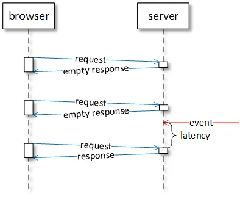
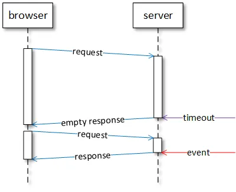

Basics :
Basics of Networking - https://www.geeksforgeeks.org/basics-computer-networking/?ref=lbp
OSI model - https://www.geeksforgeeks.org/layers-of-osi-model/

##References - https://medium.com/swlh/websockets-with-spring-part-1-http-and-websocket-36c69df1c2ee

Http Polling:
Client send a request to server and server respond back. Again client send a request in a periodic interval
and server send response. Everytime a new HTTP connection is opened and closed

Http Long polling:
Client send a request and server keep waiting until new data comes. As soon as new data comes it respond back to client
and client send another request immediately

HTTP Streaming:
Client send a request to server and keeps the connection open indefinitely. Server can keep sending new data whenever it 
is ready. It reduces a lot of network latency however it can be impacted by network intermediaries

Server-sent events:
Text only streaming mechanism where server can keep pushing the data indefinitely to client

Websockets:
Solution for all the HTTP mechanisms and provide a two-way communication (bi-directional) anytime between client and 
server.
Client open a websocket session and do handshake with server. After server acknowledge the handshake , the websocket
session is kept active until either of client/server closes it.

Here are the main differences between HTTP and WebSocket:

HTTP is a text protocol, WebSocket is a binary protocol (binary protocols transfer fewer data over the network than text protocols)
HTTP has request and response headers, WebSocket messages can have a format suitable for specific applications (unnecessary metadata are not transmitted over the network)
HTTP is a half-duplex protocol, WebSocket is a full-duplex protocol (low-latency messages can be transmitted at the same time in both directions)

https://spring.io/guides/gs/messaging-stomp-websocket/

